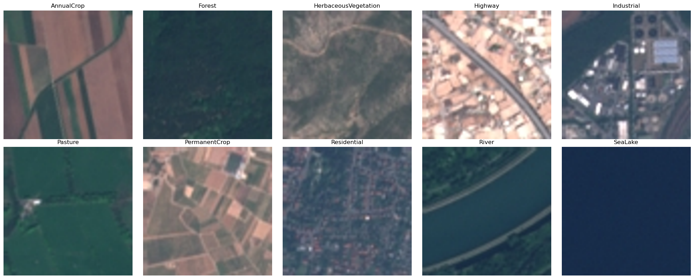
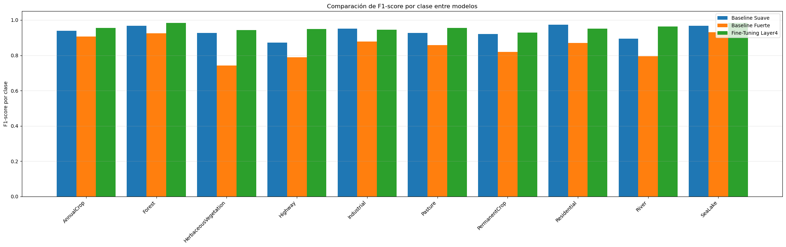
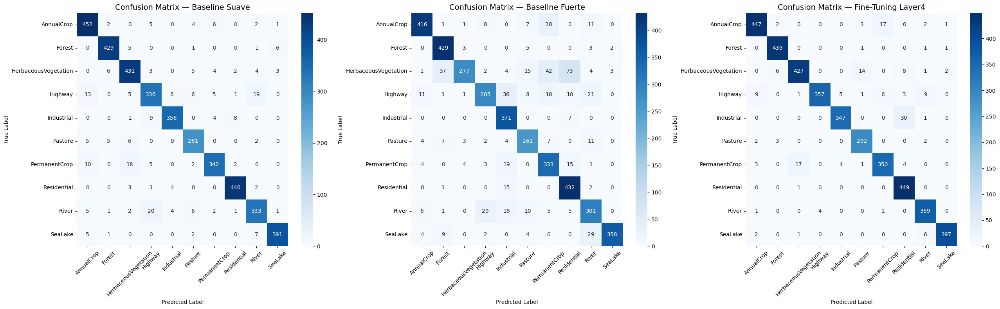
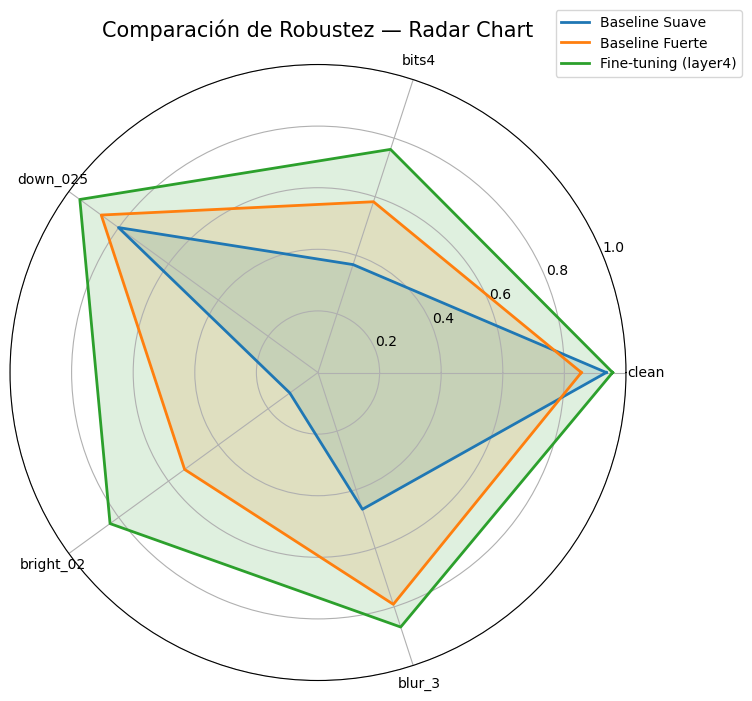

## 1. Descripción general del proyecto

Este proyecto aborda la clasificación de imágenes satelitales del dataset **EuroSAT RGB**, compuesto por diez clases de uso y cobertura del suelo derivadas de Sentinel-2. Todas las imágenes son estandarizadas a **224×224 píxeles** para su procesamiento mediante modelos **ResNet-50** preentrenados en ImageNet.

El estudio compara tres configuraciones de ResNet-50:

1. un **modelo base** con el *backbone* completamente congelado,
2. un modelo base complementado con **técnicas de data augmentation más intensivas**, y
3. un **modelo fine-tuneado** mediante la actualización selectiva de la **layer4** de la arquitectura y también se aplican técnicas de data augmentation más intensivas.

La evaluación incluye métricas clásicas de desempeño, como **accuracy**, **F1-score por clase** entre otras, y un análisis de robustez mediante **stress testing**. En el mismo, se aplicaron perturbaciones controladas (ruido, desenfoque, reducción de resolución y transformaciones geométricas, entre otras) al conjunto de test, con el fin de evaluar los límites de los modelos entrenados y analizar su comportamiento ante degradaciones de las imágenes

## 2. Configuración del entorno y preparación del dataset

El proyecto se ejecuta en un entorno basado en `conda`, cuya configuración se encuentra especificada en el archivo `environment.yml`. Este entorno incluye las dependencias necesarias para el entrenamiento de modelos con PyTorch, el preprocesamiento de imágenes, el análisis de métricas y la generación de visualizaciones.

El dataset se distribuye en un archivo comprimido (`archive.zip`) incluido en el repositorio. Al ejecutar la notebook, este archivo se extrae automáticamente y se genera la carpeta `EuroSAT_RGB`. Antes del entrenamiento, se verifica que las diez clases del dataset estén correctamente presentes, junto con el número de muestras por clase y la validez de las extensiones de los archivos.

## 3. Pipeline de entrenamiento

El pipeline de entrenamiento se organiza en torno a tres elementos principales: las transformaciones aplicadas a las imágenes, la división en entrenamiento–validación–test y las variantes del modelo ResNet-50 evaluadas. Las imágenes se procesan mediante dos conjuntos de transformaciones: una versión “suave”, basada en normalización y redimensionamiento, y otra más intensiva que incorpora técnicas de data augmentation (rotaciones, recortes aleatorios y perturbaciones de color). Esta última se emplea tanto en el modelo baseline con aumentación como en el modelo fine-tuneado, con el fin de mejorar su capacidad de generalización.

A partir de estas transformaciones se entrenan tres configuraciones de ResNet-50 preentrenada en ImageNet:

- **Baseline (backbone congelado):** utiliza únicamente las transformaciones suaves.  
- **Baseline (backbone congelado) + augmentación fuerte:** incorpora transformaciones intensivas.  
- **Fine-tuning (layer4 desbloqueada):** aplica transformaciones intensivas y habilita la actualización parcial del backbone.

Adicionalmente, se evaluaron dos valores de *learning rate* (1e-4 y 5e-4) para analizar su impacto en estabilidad y tiempos de entrenamiento. Ambos generan desempeños comparables, aunque el valor 5e-4 reduce significativamente el tiempo de entrenamiento, con una ligera disminución del rendimiento únicamente en el modelo fine-tuneado.

## 4. Evaluación de los modelos

La evaluación se realiza sobre el conjunto de test **antes del stress testing**, calculando métricas estándar como *accuracy* global y F1-score por clase. Entre las variantes consideradas, el modelo **fine-tuneado** obtiene el mejor desempeño general.

  

<em>F1-score por clase obtenido con el modelo entrenado utilizando un learning rate de 5e-4.</em>

Se incluyen matrices de confusión y ejemplos de predicciones correctas e incorrectas para ilustrar los patrones de error y las diferencias entre modelos.

  

<em>Matriz de confusión del modelo entrenado con LR = 5e-4.</em>

## 5. Stress testing

Los resultados del *stress testing* muestran que el modelo **fine-tuneado** mantiene el mejor rendimiento relativo frente a perturbaciones como ruido, desenfoque, reducción de resolución o truncamiento de bits, mientras que las variantes con el backbone congelado exhiben una degradación más pronunciada.

Estas diferencias se visualizan mediante un **gráfico radar** de accuracies bajo perturbaciones y otras representaciones comparativas incluidas en el análisis.

  

<em>Gráfico radar que resume la robustez del modelo entrenado con un learning rate de 5e-4 frente a diferentes perturbaciones aplicadas en el stress testing.</em>

## 6. Conclusiones

El modelo fine-tuneado obtiene el mejor rendimiento global y muestra la mayor robustez frente a perturbaciones aplicadas en el *stress testing*. El uso de transformaciones intensivas durante el entrenamiento resulta determinante para mejorar la capacidad de generalización en comparación con los modelos baseline. El aprendizaje con un *learning rate* mayor (5e-4) reduce significativamente los tiempos de entrenamiento y su impacto en las métricas es marginal, con una ligera disminución únicamente en el modelo fine-tuneado.

### Limitaciones del análisis

- El desbalance de clases del dataset no fue abordado explícitamente, lo que limita la interpretación de las clases con menor representación. 
- La similitud visual entre ciertas clases dificulta determinar si los errores de clasificación responden a subrepresentación o a ambigüedad intrínseca entre categorías. 
- No se realizó una búsqueda exhaustiva de hiperparámetros, por lo que las configuraciones evaluadas no necesariamente corresponden a los valores óptimos.  

